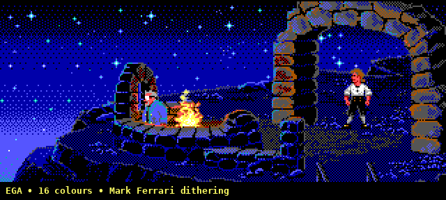
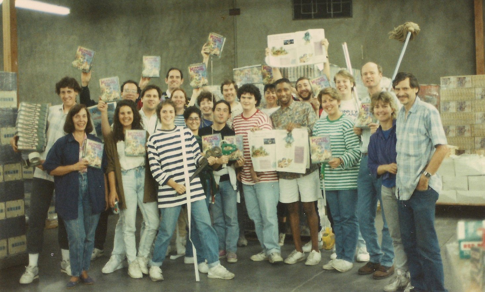

# Monkey AIsland: The Hallucination of Monkey Island

**A Generative AI Capability Benchmark by [Jamie Skella](https://www.linkedin.com/in/jamieskella/) - Framed Through the Technical Legacy of *The Secret of Monkey Island* (1990)**

**v1 March 2026:** (First generation, Perplexity Computer) [http://monkeyaisland.com/v1-2026/](http://monkeyaisland.com/v1-2026/) | Need the "hint book"? Watch the [gameplay video](https://www.youtube.com/watch?v=Sbsg-N7dzOI)

---

## The Experiment

Can AI beat a human at chess? Pfft. Jeopardy? Whatever. Pass the Turing Test? So passé... **"Can AI recreate The Secret of Monkey Island"?** *Now* we're talking... 

My daughter of seven years old has very recently become vocal about a desire to start making her own video games. She is now set up with a Steam Deck on an external monitor, using Linux desktop to bring her ideas to life, starting with no-code tools including Scratch, GDevelop, and Piskel. Coincidentally, I recently wrapped up some consulting work with a startup building GenAI tech in the video game space. This intersection of happenstance got me thinking - subconsciously at first and overtly later - about what my daughter's life might look like if she chose to pursue this career path, amidst the rise of generative AI. Will an artist have the most longevity or the highest demand? What about musician? Writer? Engineer? Or is it a case that each creative mind becomes nine-tenths of an indie studio, who can do much of all required to realise their ideas, thanks to new tooling? If that, then when might the tools be good enough to ingest ideas, specifications, assets... and generate games of the quality players expect?

**Enter Monkey AIsland**. This is not a commentary on the ethical question of whether AI should or shouldn't be used to develop a game. This is a measurement of whether AI *can*. That distinction is critical. This is a repeatable experiment designed to measure the capability of generative AI systems in the domain of game creation, run whenever frontier models receive meaningful updates and anchored to a fixed creative brief. Each output is allowed a maximum of three follow-up prompts to correct any glaring issues the initial generation missed.

The premise is straightforward. Beginning in March 2026, a generative AI system is given a prompt detailing an idea (with a reasonable assumption it could do even better using a prompt which resembled clear specification): produce a complete, playable point-and-click adventure game as a spiritual - and explicitly unofficial - successor to *The Secret of Monkey Island*. The game must include original characters, backgrounds, animations, music, script, audibly voice-acted dialogue, and a functioning puzzle chain. It must be narratively self-aware, breaking the fourth wall to acknowledge and satirise its own AI-generated nature. It is called "Monkey AIsland".

  

Monkey Island is a deliberate choice of reference point. A point-and-click adventure is one of the most compositionally demanding formats in games. It requires competence across every creative discipline simultaneously: visual art (backgrounds, character sprites, animation), narrative design (branching dialogue, world-building, humour), game design (puzzle logic, inventory systems, state management), audio (music composition, adaptive scoring, voice acting), and software engineering (rendering, input handling, scene management). Every element must be authored and integrated - which makes it a genuinely compelling stress test for a generative system's breadth.

<figure style="text-align:center;">
  
  <figcaption style="max-width:640px; margin:0.5em auto 0;">
    The LucasArts team packing boxes of <em>The Secret of Monkey Island</em> for shipment, c. 1990. Among them: Ron Gilbert, Tim Schafer, Dave Grossman, Steve Purcell, Mark Ferrari, and the rest of the crew who built a genre‑defining classic.
  </figcaption>
</figure> 

The original Monkey Island took a team roughly nine months to produce, including design, art, programming, music, and testing. It was the output of a deep pipeline of human expertise. Asking a generative AI to produce an equivalent in a single session is, by any reasonable measure, an unfair comparison - and that's precisely the point. Unfair comparisons are sometimes the most important kind. This experiment doesn't ask whether AI can match a team of humans working for almost a year. It asks how close it can get in a fraction of the time, and whether that distance shrinks year over year, generation to generation.

---

## Why Monkey Island Matters

In October 1990, Lucasfilm Games - an experimental studio funded by George Lucas, working out of Skywalker Ranch - released *The Secret of Monkey Island*. It redefined the genre, and redefined what interactive storytelling could be.

What made Monkey Island technically significant wasn't any single innovation but a constellation of them, each reinforcing the others. The game was the fifth title built on the SCUMM engine (Script Creation Utility for Maniac Mansion), a system originally developed by Ron Gilbert for the 1987 title *Maniac Mansion*. By the time it reached Monkey Island, SCUMM had matured into something genuinely ahead of its time: a cross-platform scripting environment with multitasking capabilities, allowing background actors to animate, clocks to tick, and ambient events to unfold while the player thought about their next move. It was, in effect, a game engine that separated logic from presentation. Designers could prototype rooms and puzzles on Sun workstations using tools built in C and YACC, then compile for target hardware. Most studios of the era wrote code and ran code on the same limited machine. LucasArts operated more like a software engineering firm - and there was an institutional rigour to the companion tooling that was rare in the industry. FLEM (for placing objects in rooms), BYLE (for compiling), SPIT (for font design), and SPUTM (the SCUMM Presentation Utility).

That constellation extended to the visual - a particular point of interest for me as a visual designer and RetroTINK user. The backgrounds of *The Secret of Monkey Island* owed their atmospheric depth to artist Mark Ferrari, whose pioneering use of colour dithering transformed what was possible within the brutal constraints of EGA's 16-colour palette. Ferrari had first introduced dithering to Lucasfilm Games through an act of quiet provocation: on the final day of production on *Zak McKracken and the Alien Mindbenders* (1988), he left a dithered twilight scene on his monitor and went to lunch. The image - rolling hills, live oaks, a moon rising in a blended sky - was so obviously superior to anything achievable with solid EGA colours that it sparked an immediate debate between Ron Gilbert and the head of the games division about whether dither could be compressed. Within two months, it could. By the time Ferrari led the background art on Monkey Island, dithering had become a house technique, allowing him to suggest hundreds of intermediate tones from just 16 source colours and lending the game's environments a painterly quality that its contemporaries, working in flat fills, couldn't match. 

To speak of a pre-Monkey Island and post-Monkey Island era of video games, as the digital historian Jimmy Maher has observed, would not be at all out of order. Designers at other studios - from Sierra's Corey Cole to Legend Entertainment's Bob Bates - cite it unprompted as a work that fundamentally changed their approach to design. The SCUMM engine went on to power twelve LucasArts titles over a decade, and its philosophy of separating scripting from rendering anticipated the architecture of modern game engines by years.

---

## First Generation: March 2026

### System and Constraints

The first generation of Monkey AIsland was produced using Perplexity Computer in March 2026. The system was given a single natural-language prompt describing the creative brief. No code was pre-written. No assets were provided. No reference material was supplied beyond the prompt itself. Every decision - engine architecture, art style, music approach, puzzle design, script, deployment - was the system's own.

### What Was Produced

The system generated a complete, browser-based point-and-click adventure game with the following components:

| Component | Description |
|---|---|
| **Scenes** | Six fully illustrated backgrounds: title screen, harbour dock, SCUMM Bar tavern, jungle path, moonlit beach, voodoo cave. Each rendered in pixel art style via AI image generation. |
| **Characters** | Five distinct NPCs with unique sprites, dialogue trees, and personality: Guybrush Promptwood (protagonist), Murray the Skull, ChatGPeeTee (bartender), Governor Elaine Markup, and MidJourney (Voodoo Lady). |
| **Interface** | Classic SCUMM-style verb bar with nine verbs (Walk to, Look at, Pick up, Use, Talk to, Give, Push, Pull, Open), inventory management, and context-sensitive interaction. |
| **Puzzles** | A complete six-item puzzle chain requiring item collection, combination, and NPC interaction across all scenes, culminating in a voodoo ritual victory condition. |
| **Voice Acting** | 78 individually generated voice lines across six distinct characters, each with a unique ElevenLabs voice. Guybrush Promptwood speaks his dialogue choices aloud before NPCs respond. A narrator provides voiced scene descriptions, item examinations, and action feedback. Voice playback is synchronised with text display timing. |
| **Music** | Procedural Caribbean/calypso soundtrack generated in real time via the Web Audio API. No pre-recorded audio files. |
| **Script** | Branching dialogue with fourth-wall-breaking humour throughout. Characters acknowledge and mock their AI-generated nature. |
| **Engine** | Single-file HTML/CSS/JavaScript application (~1,800 lines), canvas-rendered with DOM overlays for UI, voice audio engine with preloading and playback synchronisation, deployed as a static website. |

### Observations

The result is a playable game - not a tech demo, not a proof of concept, but a game with a beginning, middle, and end. A player can walk between scenes, talk to characters, collect items, solve puzzles in sequence, and reach a victory state. The verb bar works. The inventory works. The music plays. Every character speaks with a distinct voice. Characters say things that are, very occasionally, genuinely funny. Props to GenAI for weaving in rubber chickens and melting jugs of grog - tidy little hat-tips to the original game.

It is also, by any honest accounting, not in the same category as the 1990 original. The pixel art backgrounds, while atmospheric and stylistically coherent, lack the hand-crafted intentionality of the original's art direction. The character sprites don't feel coherent with the game world and the animations are rudimentary. The puzzle design, while functional, is not compelling. The music is barely that, it couldn't be further away from a Michael Land composition. The voice acting gives each character audible personality but doesn't approach the nuanced performance direction of professional actors like Dominic Armato, whose portrayal of Guybrush Threepwood in *The Curse of Monkey Island* set a standard these AI voices don't nearly reach. The script is witty in places but doesn't sustain the comedic rhythm that made the original's writing exceptional across hours of play.

None of this is surprising. What is worth noting is what the system *did* manage to produce without explicit instruction. It chose an appropriate engine architecture (canvas with DOM overlays). It selected a verb set that maps closely to the original. It designed a puzzle dependency chain that requires multi-step thinking. It generated procedural audio rather than trying to source external music files. It cast six distinct synthetic voices across 78 dialogue lines and built an audio engine to synchronise voice playback with text display. It wrote dialogue that is self-referentially aware in a structurally consistent way - not merely random. It built the whole thing as a deployable web application.

Broad competence across every required discipline. No single discipline absent. The gaps were in depth, not breadth.

---

## Methodology

To maintain consistency across time, the following protocol will be observed for each generation:

1. The same creative brief will be used, verbatim - no modifications, no added context, no hints from prior generations.
2. The game will be produced using a generally available AI system at the time, in a single conversational session.
3. No pre-written code, assets, templates, or reference material will be supplied. The system starts from the prompt alone.
4. The output will be deployed as a publicly accessible web application.
5. Each generation will be preserved in its original form alongside this document, creating a longitudinal record.
6. Evaluation will be qualitative and structured, tracking progress across the dimensions listed in the scorecard below.

### Evaluation Dimensions

Each generation will be assessed against the following dimensions, scored qualitatively to track progression over time:

| Dimension | What It Measures | March 2026 |
|---|---|:---:|
| **Visual Art** | Quality, consistency, and intentionality of backgrounds, characters, and animation | Basic |
| **Narrative Design** | Dialogue quality, comedic timing, world-building, fourth-wall execution | Competent |
| **Puzzle Design** | Logical elegance, multi-step complexity, player guidance, fairness | Basic |
| **Audio** | Musical quality, adaptive behaviour, thematic appropriateness | Basic |
| **Voice acting** | Comedic timing, emotional nuance, alignment with narrative tone  | Basic |
| **Engineering** | Code architecture, performance, deployment, cross-browser support | Competent |
| **Game Feel** | Responsiveness, polish, the intangible sense that the game "works" | Acceptable |
| **Creative Coherence** | Whether all elements feel like they belong to the same game world | Basic |

This isn't intended to be a rigorous scientific instrument - it's a structured observation framework. The value isn't in any individual score but in the delta between generations.

---

## Looking Forward

The original *Secret of Monkey Island* endures not because of its pixel art or its MIDI soundtrack but because every element serves a unified creative vision. The puzzles reinforce the narrative. The humour emerges from the mechanics, not just the dialogue. The interface disappears into the experience. This is what Gilbert meant when he argued that a game should make the player forget they're solving puzzles and simply feel immersed in a world.

Whether a generative AI can achieve that kind of holistic creative integration - not just produce all the individual parts but make them *cohere* - is the real question this experiment tracks. The first generation demonstrates breadth. The question for subsequent generations is depth. Can the puzzle design develop the layered elegance of the original? Can the script sustain comedic rhythm across an entire playthrough? Can the music respond dynamically to player behaviour in the tradition of iMUSE (Monkey Island 2)? Can the game feel like it was *designed*, not just *generated*?

In 1990, it took a team of dedicated professionals nine months and a custom engine refined across four prior titles to produce a game that would go on to be named among the greatest ever made. In 2026, a generative AI produced a fully voice-acted, playable, self-aware spiritual successor in a single session. The gap between the two is vast. How far it narrows is what we'll find out.

This document will grow with each new AI generation, with a new section recording its capabilities, its limitations, and the distance that remains. Monkey AIsland is, in that sense, both a game and a measuring stick: built in tribute to one of the most important games ever made, and rebuilt periodically by GenAI to track the progress of the machines that are learning to make them.

GitHub repo: [https://github.com/jamieskella/monkeyaisland.github.io](https://github.com/jamieskella/monkeyaisland.github.io/)
